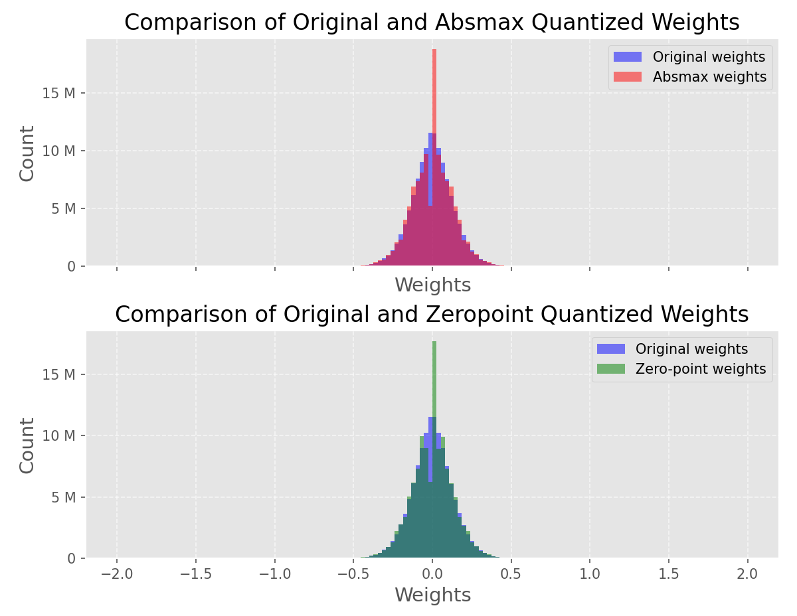
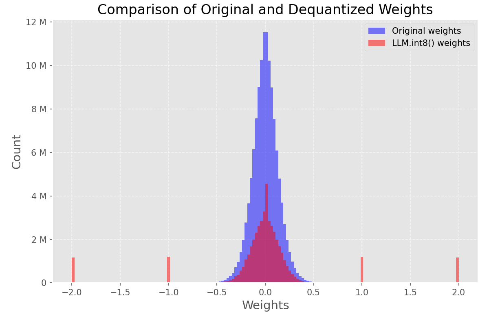

# Model Quantization with GPT-2

This project demonstrates quantization techniques applied to the GPT-2 model, including **absmax**, **zero-point**, and **8-bit quantization** (via Hugging Face's `bitsandbytes`). It evaluates the impact of quantization on model performance, weight distribution, perplexity, and memory footprint.

## Features

- **Quantization Methods**:
  - Absmax Quantization
  - Zero-Point Quantization
  - 8-bit Quantization (LLM.int8())
- **Visualization** of weight distributions before and after quantization.
- **Text Generation** examples from quantized models.
- **Perplexity Evaluation** and **Memory Compression Rate** comparison.

## Installation

1. **Dependencies**:
   - Python 3.8+
   - PyTorch (CUDA-compatible if using GPU)
   - Hugging Face `transformers` and `datasets`
   - `bitsandbytes` for 8-bit quantization
   - `matplotlib` for visualization

   Install with:
   ```bash
   pip install torch transformers datasets bitsandbytes matplotlib
   ```

2. **Hardware**:
   - A GPU is recommended for faster inference (code auto-detects CUDA).

## Usage

### 1. Run the Full Script
Execute the provided `quantization.py` to:
- Quantize the GPT-2 model using all methods.
- Generate text samples.
- Plot weight distributions and compute metrics.

```bash
python quantization.py
```

### 2. Key Components
- **Quantization Functions**:
  - `absmax_quantize()`: Scales weights to the int8 range using absolute max.
  - `zeropoint_quantize()`: Uses a zero-point shift for symmetric quantization.
- **Model Loading**:
  ```python
  model = AutoModelForCausalLM.from_pretrained("gpt2")
  model_int8 = AutoModelForCausalLM.from_pretrained("gpt2", load_in_8bit=True)
  ```
- **Visualization**: Histograms compare original vs. quantized weights.
- **Text Generation**:
  ```python
  generate_text(model, "I want to play")
  ```

## Results

### 1. Weight Distribution
- Histograms show the distribution of weights for:
  - Original Model
  - Absmax Quantized
  - Zero-Point Quantized
  - LLM.int8() Quantized

### 2. Text Generation Examples
Samples generated from each model (original and quantized variants) are printed.

### 3. Metrics
- **Perplexity**:
  - Original model typically has the lowest perplexity.
  - Quantized models show slightly higher perplexity (trade-off for compression).
- **Memory Footprint**:
  - GPT-2’s original size: ~500MB.
  - 8-bit quantized model reduces size by ~60%.

Example output:
```
Original perplexity:  10.59
Absmax perplexity:    20.95
Zeropoint perplexity: 23.95
Perplexity (LLM.int8()): 8.90

==== model compressibility ====
Original model: 523,123,456 bytes
8-bit Quantized Model: 176,527,896 bytes
Compression Rate: 65.41%
```

==== Weight comparison ====


